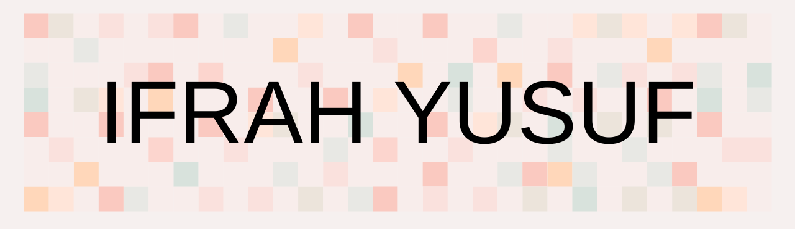

<h4>Software Engineer with a keen eye for detail and a background in Education. Looking to work in a team of like-minded engineers to create software that brings about change and solve everyday problems. See what I'm up to on Twitter and see my website for more information.</h4>

  

- 🔭 I’m currently working on **Freelancing projects and building API Applications.**

- 🌱 I’m currently learning **Node and Express.js**

- 👯 I’m looking to collaborate on **Full-stack projects to support local communities.**

- 🤝 I’m looking for help with **Networking and connecting with like minded people.**

- 👨‍💻 All of my projects are available at [https://ifrahcodes.netlify.app/](www.ifrahcodes.netlify.app)

- 📝 I regularly tweet my coding frustrations on twitter [@ifrahcodes](@ifrahcodes)

- 💬 Ask me about **Javascript, HTML, CSS, Node and coding challenges**

- 📫 How to reach me **ifrah2005@outlook.com**

- ⚡ Fun fact **I am a literature & poetry nerd so if you have any classical books or poetry to recommend, please do so!**
<h1 align="center">Projects</h1>
<table bordercolor="#66b2b2">
  
  <tr>
    <td width="50%" valign="top">
      <h3 align="center">Salon Website</h3>
         
        
         
        

          
    
  
      

        
<strong>HTML5, CSS3 & JavaScript</strong> - This is a responsive website created using HTML markup and CSS for a curly hair salon. The design is sleek and modern and the website does a good job of showcasing all the brilliant services available. 

    </td>
    <td width="50%" valign="top">
      <h3 align="center">99 Names Of Allah APP</h3>
         
      
         
        

          
  
  
      

        
<strong>HTML5, CSS3 & JavaScript</strong> - This is an API application creasted using an API URL from Prayers.com/API that generates a new name at just the click of a button!

    </td>
  </tr>
  
  <tr>
    <td width="50%" valign="top">
      <h3 align="center">Portfolio Website</h3>
       
        
       
        

  
  
      

        
<strong>HTML5, CSS3, & Javascript</strong> - This is a portfolio Site coded from scratch including links to my projects and ways to get in contact with me.

    </td>
    <td width="50%" valign="top">
      <h3 align="center">Weather APP</h3>
         
        
         
        

          
  
  
      

        
<strong>HTML5, CSS3 & Javascript</strong> - This is a beautifully designed weather API application that uses an API URL from openweather.com/URL in which the user can search up the weather in different cities.

    </td>
  </tr>
</table>

<h3 align="left">Connect with me:</h3>

<h3 align="left">Languages and Tools:</h3>

             

<!---
IfrahYusuf/IfrahYusuf is a ✨ special ✨ repository because its `README.md` (this file) appears on your GitHub profile.
You can click the Preview link to take a look at your changes.
--->
